# MEDLOG KİSİSEL İLAC ASISTANIM

[▶️ Proje Tanıtım Videosunu İzlemek İçin Tıkla](https://youtu.be/Swn1Xp4rR7w)

#  MedLog - Kişisel İlaç Takip Asistanı

**MedLog**, kullanıcıların ilaçlarını zamanında almasını sağlayan, stok takibi yapabilen ve gelişmiş bildirim sistemine sahip bir Flutter uygulamasıdır. 

##  Özellikler

* ** Akıllı Bildirim Sistemi:** * Cihazın yerel saat dilimini (`flutter_timezone`) otomatik algılar.
    * Emülatör ve gerçek cihaz arasındaki saat farkı sorununu ortadan kaldırır.
    * İlaç saatlerini "AM/PM" veya "24 Saat" formatında sorunsuz işler.
* ** Stok Takibi & Uyarılar:**
    * Her ilaç için kalan stok miktarını gösterir.
    * Stok kritik seviyeye (5 ve altı) düştüğünde gösterge **kırmızıya** döner.
* ** Koyu/Açık Mod Desteği:** * `ValueNotifier` ile anlık tema değişimi.
    * Göz yormayan özel "Teal" (Turkuaz) renk paleti.
* **Arşivleme (Soft Delete):**
    * İlaçlar silindiğinde kaybolmaz, "Arşiv" klasörüne taşınır.
    * Yanlışlıkla silinen ilaçlar geri getirilebilir.
* ** Çevrimdışı Veritabanı:**
    * SQLite (`sqflite`) ile veriler cihazda güvenle saklanır. İnternet gerektirmez.

## 🛠️ Kullanılan Teknolojiler ve Paketler

Proje **Flutter** altyapısı ile geliştirilmiştir ve aşağıdaki temel paketleri kullanır:

| Paket | Amaç |
|---|---|
| `flutter_local_notifications` | Zamanlanmış yerel bildirimler için. |
| `flutter_timezone` | Cihazın saat dilimini (Örn: Europe/Istanbul) algılamak için. |
| `timezone` | Tarih ve saat hesaplamaları için. |
| `sqflite` | Yerel SQL veritabanı yönetimi. |
| `intl` | Tarih formatlama ve yerelleştirme. |
| `path_provider` | Dosya yollarına erişim. |

## 📸 Ekran Görüntüleri ve İşleyiş

* İlaç ekleme ekranın 3 kategoride ilaç ekleyebilirsiniz: Günlük, Haftalık ve Özel.
* Günlük içmeniz gereken ilaçlar için günlük kategorisini kullanabilirsiniz.
* Haftanın belirli günlerinde, belirli saat ve öğünlerde, belirli dozlarda almanız gereken ilaçlar için Haftalık kategorisini kullanabilirsiniz.
* Özel kategorisinde saatlik almanız gereken ilaçlar için tasarlanmıştır.

  
| 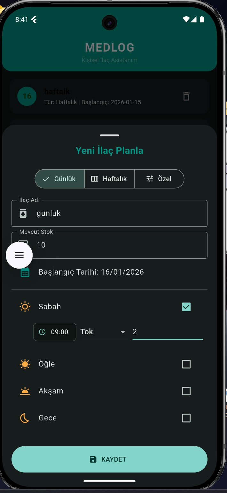 |
| 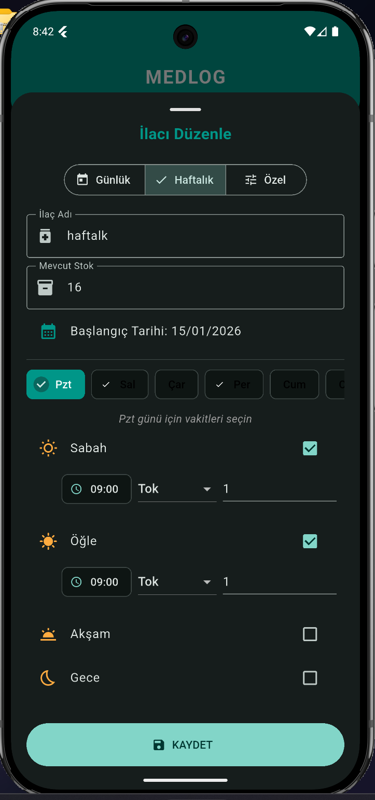 |
| 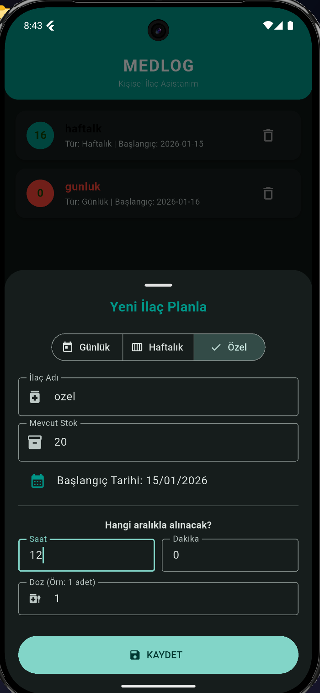 |

* Takvim sayfasından ilacınızın takibini yapabilirsiniz.

| 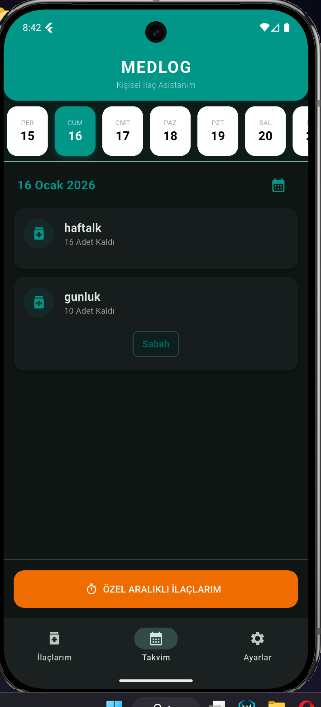 |
|  |
| 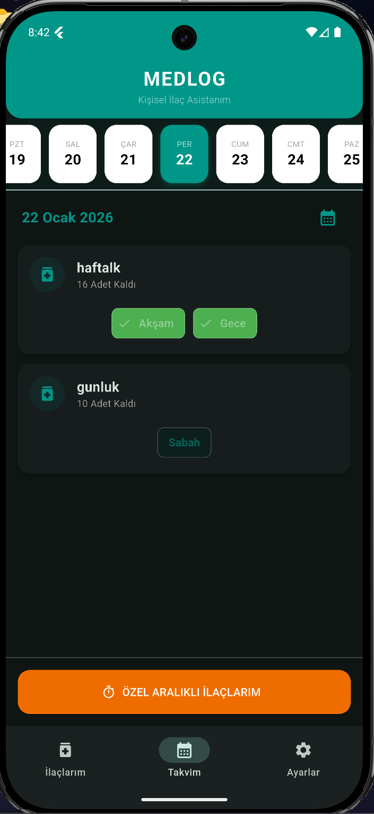 |
| 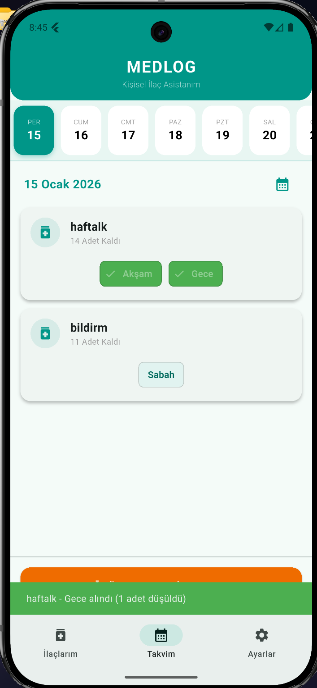 |
| 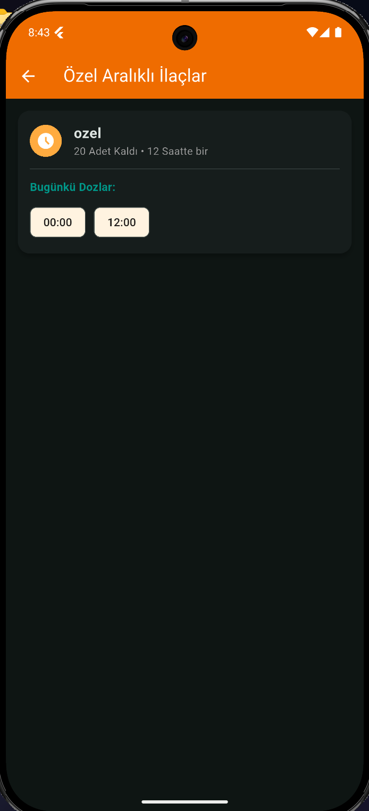 |

*Stoğunuz 5'in altına düştüğünde uygulama size ilacınızın azaldığını gösterecek ve ilacınızı kırmızılaştıracaktr.

| 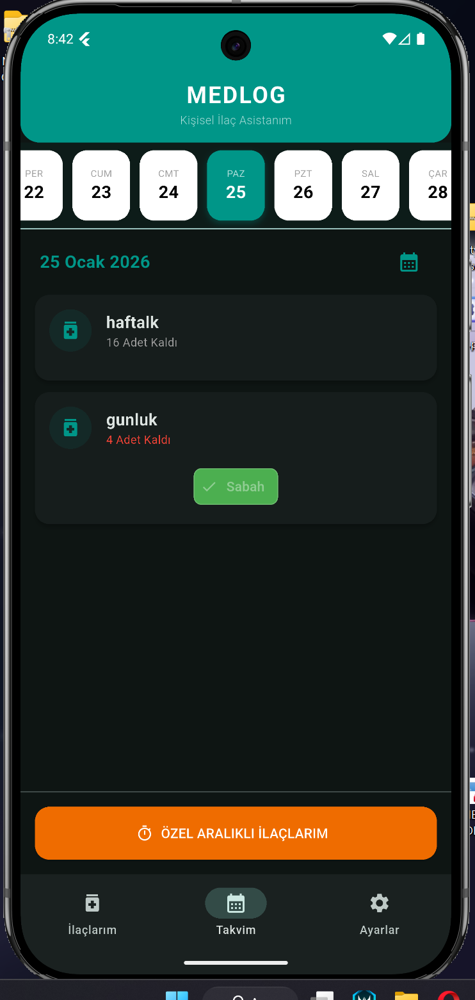 |
| 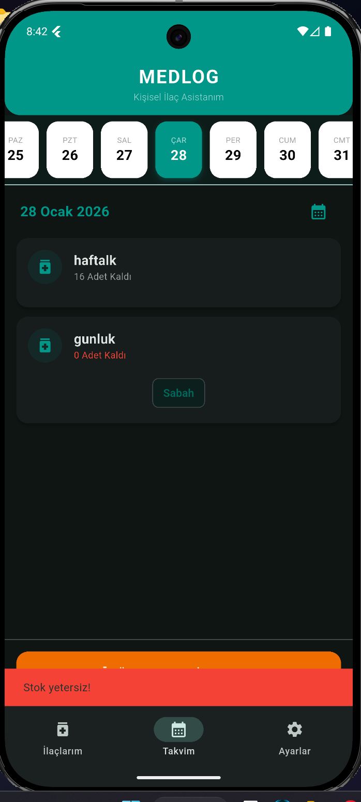 |

*İlacınızı düzenlemek için ilaçlarım sayfasında düzenlemek/güncellemek istediğiniz ilacın üzerine bir kez tıklamanız yeterlidir.

| 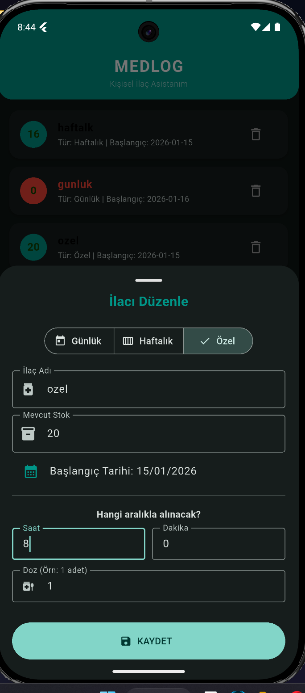 |
| 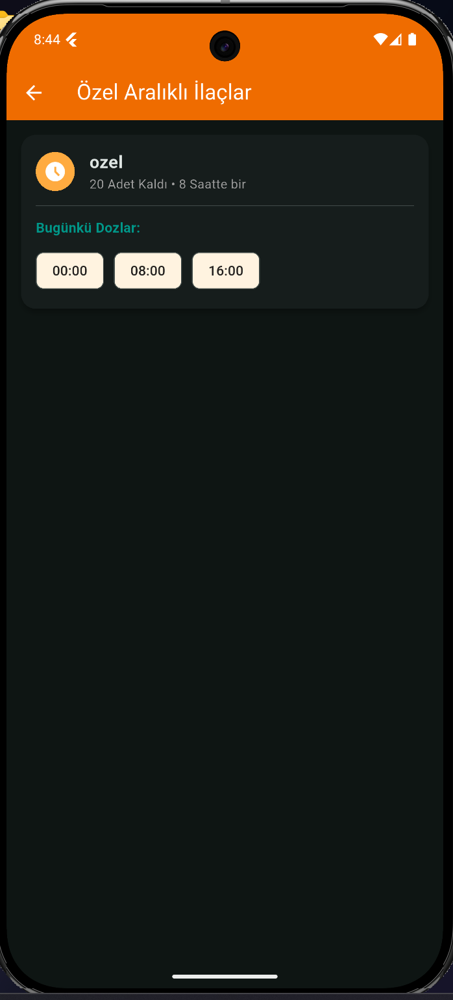 |

*Ayarlar sayfasından uygulamanızın koyu/açık mod ayarını yapabilirsiniz. Dilerseniz Arşivden sildiğiniz ilaçları geri getirebilir ya da tamamen silebilirsiniz.

| 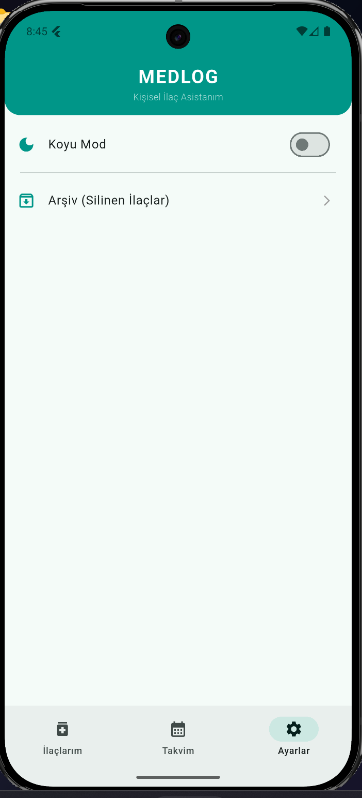 |
| 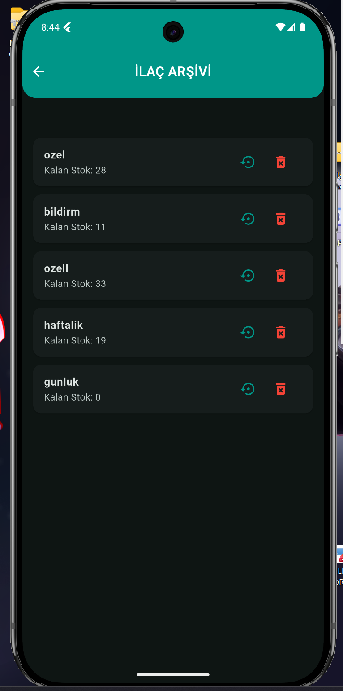 |
| 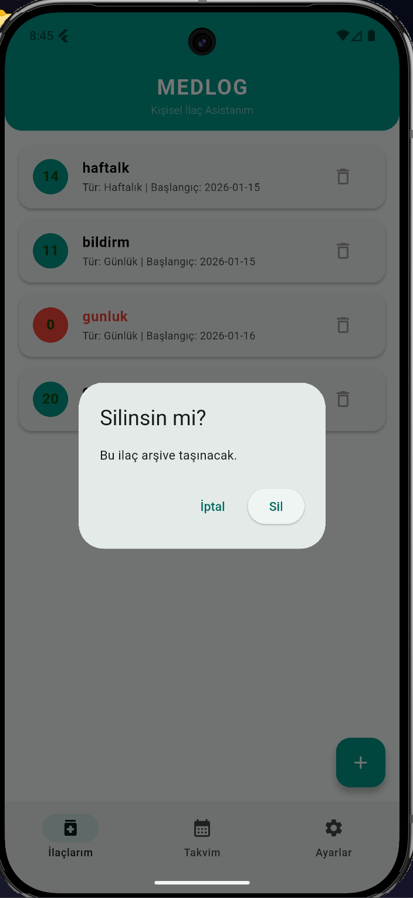 |
| 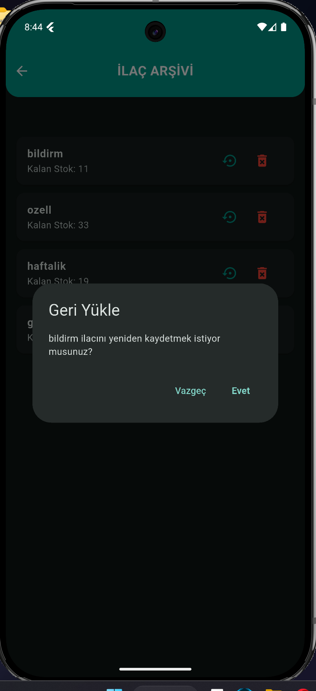 |
| 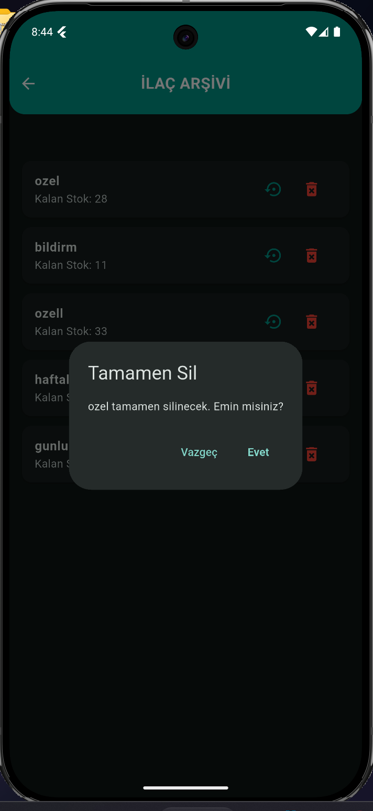 |

## Notlar

* **Android Ayarları:** Bildirimlerin çalışması için `AndroidManifest.xml` içinde gerekli izinlerin (`RECEIVE_BOOT_COMPLETED`, `VIBRATE`) tanımlı olduğundan emin olun.
* **Timezone:** Uygulama `main.dart` içinde `tz.initializeTimeZones()` fonksiyonunu asenkron olarak bekler.

## Katkıda Bulunma

Her türlü katkıya açığım. Hata bildirmek veya yeni özellik eklemek için lütfen "Issue" açın veya "Pull Request" gönderin.

---
**Geliştirici:** [Fatma Büyükçamsarı-132330014]
